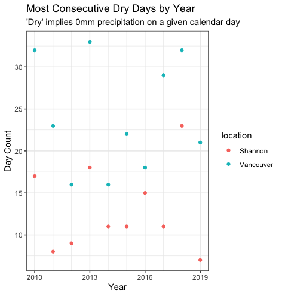
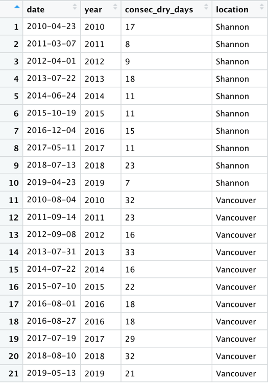
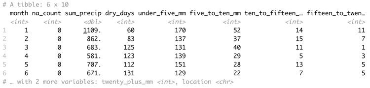
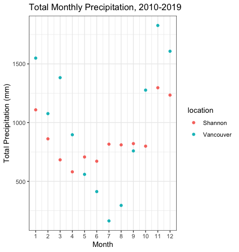
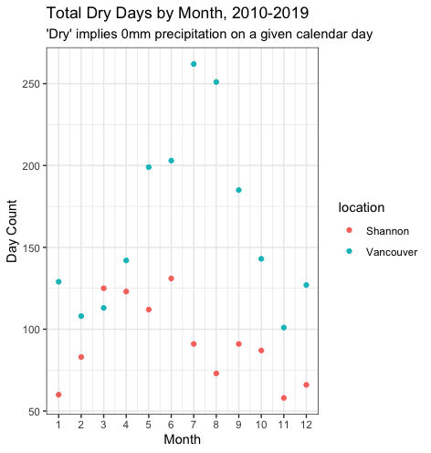
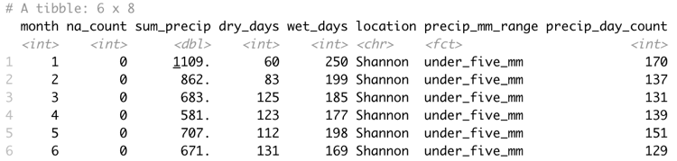
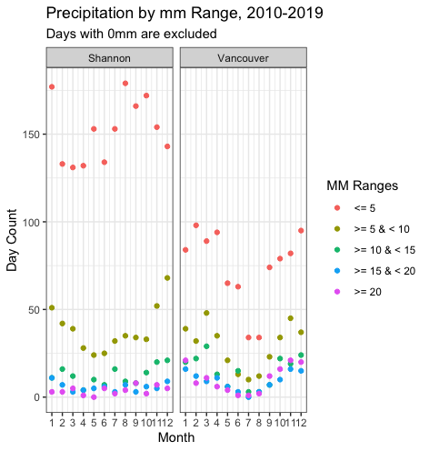

Having moved from the West of Ireland to the Pacific North West I was interested to observe that, while both people regularly complain about the rain, the rainfall patterns appeared quite different. That initial observation led me to wonder how similar, or different, the patterns are between the two regions? This blog describes the process of accessing historical weather data, processing the dataframes with R, and visualizing the findings with R’s ggplot2 package. In doing so I will hopefully reach a conclusion as to which ‘West Coast’ has more cause to complain about rainfall. The weather stations we’ll reference are located at Shannon and Vancouver international airports.

### Sourcing and Accessing Data

Initial Google searches will likely lead to the R package ‘weatherData’. It’s worth noting that despite its prominence in google search results, this package [no longer works](https://github.com/Ram-N/weatherData/issues/41) due to its API source, Weather Underground, moving to a paid model. A follow-up search may reference Weather Underground’s own R package, though it’s worth noting that their free-tier requires users to maintain a personal weather station in order to receive an API key.

I found the most appropriate solution was to pull data directly from the relevant national meteorological services. As many meteorological services have begun publishing their own R packages in recent years, Canadian data is accessible from the ‘weathercan’ package. The Irish Meteorological Service, Met Éireann, does not maintain an R package, but provides csv data for download from [met.ie](https://www.met.ie/ga/climate/available-data/historical-data).

### Determining Metrics

While Irish records track all forms of precipitation under a single count, Canadian records [differentiate between ‘total rain’ and ‘total precipitation’](https://climate.weather.gc.ca/glossary_e.html#totalPrec). The latter includes all forms of precipitation while the former includes ‘all liquid precipitation’ but excludes snowfall. As snow is far more common in Vancouver than Shannon and the subject of this study is rainfall, it’s tempting to compare Shannon’s total precipitation to Vancouver’s total liquid precipitation. Ultimately though, it makes the most sense to stay consistent and compare identical metrics.

### Importing Data

For the csv file from [met.ie](https://www.met.ie/ga/climate/available-data/historical-data), it’s necessary to read from line 25 onwards, as the lines before this contain the dataset’s glossary. For the Canadian data, it’s necessary to concatenate data from two datasets as Vancouver International Airport’s weather station changed in June 2013.

```r 
# get shannon data.
# Csv file sourced for 'SHANNON AIRPORT' weather station at https://www.met.ie/ga/climate/available-data/historical-data
shannon_df <-
  read.csv("dly518.csv", skip = 24)

# get vancouver data
pre_2013_van_df <-
  weather_dl(
    station_ids = 889,
    interval = "day",
    string_as = NULL,
    start = "2010-01-01",
    end = "2013-06-12"
  )
post_2013_van_df <-
  weather_dl(
    station_ids = 51442,
    interval = "day",
    string_as = NULL,
    start = "2013-06-13",
    end = "2019-12-31"
  )
vancouver_df <- rbind(pre_2013_van_df, post_2013_van_df)
```

### Standardizing the Data Frames

In order to efficiently work with these data frames, it’s necessary to format their date columns, restrict their date ranges, and standardize their column names.

```r 
# format dates
shannon_df$date <- as.Date(shannon_df$date, format = "%d-%b-%Y")
vancouver_df$date <- as.Date(vancouver_df$date)

# filter Shannon dataframe to last ten years
shannon_df <-
  shannon_df[shannon_df$date >= "2010-01-01" &
               shannon_df$date <= "2019-12-31",]

# add consistent month and year columns
shannon_df <- shannon_df %>%
  mutate(month = month(date), year = year(date))
vancouver_df <- vancouver_df %>%
  mutate(month = month(date), year = year(date))

# standardize column names for convenience
setnames(shannon_df, "rain", "total_precip")
```

### Calculating the Highest Count of Consecutive Dry Days for each Year

My approach was to group each period of consecutive dry days with a unique id for each, before using these ids to get the highest count for each year.

```r 
get_consec_dry_day_count <- function(df, region_name) {
  processed_df <- df %>%
    group_by(consec_dry_id = rleid(total_precip == 0)) %>%
    mutate(consec_dry_days = if_else(total_precip == 0, row_number(), 0L)) %>%
    group_by(consec_dry_id) %>%
    top_n(1, consec_dry_days) %>%
    group_by(year) %>%
    top_n(1, consec_dry_days) %>%
    mutate(location = region_name) %>%
    select(date, year, consec_dry_days, location)
  
  return(processed_df)
}

shannon_consec_dry_day_df <-
  get_consec_dry_day_count(shannon_df, "Shannon")
vancouver_consec_dry_day_df <-
  get_consec_dry_day_count(vancouver_df, "Vancouver")
consec_dry_day_df <-
  rbind(shannon_consec_dry_day_df, vancouver_consec_dry_day_df)
```

The data showed that Vancouver consistently had the highest number of consecutive dry days.



The data showed that Vancouver’s driest consecutive periods were typically in the months of July-September while Shannon was far less predictable. These dates could be included as tooltip values if creating interactive plots.



### Get Monthly Insights

In terms of monthly insights, I was interested in total precipitation volume, volume by ranges, and counting dry days (days with 0mm precipitation). I also checked for NA values, of which there were 28 for Vancouver and 0 for Shannon.

```r 
get_monthly_insights <- function(df, region_name) {
  processed_df <- df %>%
    group_by(month) %>%
    summarise(
      na_count = sum(is.na(total_precip)),
      sum_precip = sum(total_precip, na.rm = T),
      dry_days = sum(total_precip == 0, na.rm = T),
      under_five_mm = sum(total_precip > 0 &
                            total_precip < 5, na.rm = T),
      five_to_ten_mm = sum(total_precip >= 5 &
                             total_precip < 10, na.rm = T),
      ten_to_fifteen_mm = sum(total_precip > 10 &
                                total_precip < 15, na.rm = T),
      fifteen_to_twenty_mm = sum(total_precip >= 15 &
                                   total_precip < 20, na.rm = T),
      twenty_plus_mm = sum(total_precip >= 20, na.rm = T)
    ) %>%
    mutate(location = region_name)
  
  return(processed_df)
}

shannon_monthly_insights_df <-
  get_monthly_insights(shannon_df, "Shannon")
vancouver_monthly_insights_df <-
  get_monthly_insights(vancouver_df, "Vancouver")
monthly_insights_df <-
  rbind(shannon_monthly_insights_df, vancouver_monthly_insights_df)
```



The resulting plots show greater precipitation volumes in Vancouver for the months of October to April, and higher counts of dry days in Vancouver for all but the month of March.





### Calculate for mm Ranges

For plotting the precipitation range columns, it was necessary to convert the dataframe to long format in order to plot the data by individual facets.

```r 
long_format_monthly_insights_df <-
  gather(
    monthly_insights_df,
    precip_mm_range,
    precip_day_count,
    under_five_mm:twenty_plus_mm,
    factor_key = TRUE
  )
```



This plot required more customization than the others and included a custom legend.

```r 
ggplot(data = long_format_monthly_insights_df) +
  geom_point(mapping = aes(x = month, y = precip_day_count, color = precip_mm_range)) +
  facet_wrap(~ location) +
  labs(
    title = "Precipitation by mm Range, 2010-2019",
    subtitle = "Days with 0mm are excluded",
    y = "Day Count",
    x = "Month"
  ) +
  theme_bw() +
  scale_x_continuous(breaks = c(1, 2, 3, 4, 5, 6, 7, 8, 9, 10, 11, 12)) +
  scale_colour_discrete(
    name  = "MM Ranges",
    breaks = c(
      "under_five_mm",
      "five_to_ten_mm",
      "ten_to_fifteen_mm",
      "fifteen_to_twenty_mm",
      "twenty_plus_mm"
    ),
    labels = c("<= 5", ">= 5 & < 10", ">= 10 & < 15", ">= 15 & < 20", ">= 20")
  )
```



### Conclusion

The findings show that Vancouver gets higher volumes of precipitation in shorter, isolated periods, while maintaining clear seasons with far less rain in Summer. In contrast, Shannon typically has far fewer consecutive dry days and far more days with 0 to 5 mm of rainfall.
Ultimately, with something as arbitrary as complaining about the weather, people are always going to find an angle to lament their own experiences. In that spirit I’m going to conclude that Ireland has more cause to complain on the grounds that its weather requires its people to carry umbrellas on a higher number of days per year.

This project’s source code is viewable on [GitHub](https://github.com/oisinBates/shannon_vancouver_weather_data).
