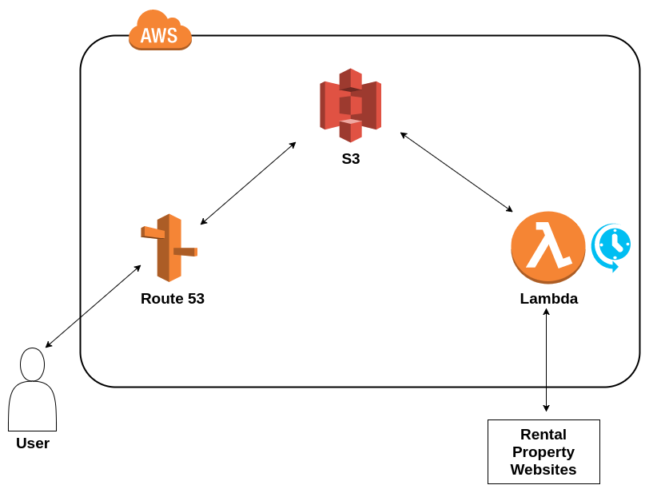

`cheapdublinrent.guru` began as a hobby project while I was studying for Amazon Web Services' Associate Solutions Architect certificate. Since then I have received my certification and, due to a handful of external factors, have decided not to move ahead with rental-property web-scraping as a long-term project.

Its primary goal was as a proof-of-concept site, demonstrating a simple static-site architecture which accomodated for its data to be updated throughout the day, in turn availing of the instant-scalability and extremely low cost of AWS Lambda and S3 static-site-hosting.

### Architecture

1. Data is scraped using an AWS Lambda function and the python library [BeautifulSoup](https://www.crummy.com/software/BeautifulSoup/bs4/doc/).
2. The same Lambda function then updates a .json file which holds relevant data for each property listing. Each key in the .json file has a 'price' value which can be referenced when updating the file. This .json file is stored in an AWS S3 bucket and accessed using the Python interface [Boto](https://boto3.readthedocs.io/en/latest/).
3. This lambda function can be scheduled to run on at set times using a [cron expression](https://docs.aws.amazon.com/lambda/latest/dg/services-cloudwatchevents.html).
4. On the Front End, a Bootstrap website - hosted via AWS Route 53 and S3 - uses jQuery to pull from the .json file and populate the site with the contents of this JSON file.

This project's GitHub repo is viewable [here](https://github.com/oisinBates/serverless_aws_property_scraper_project).