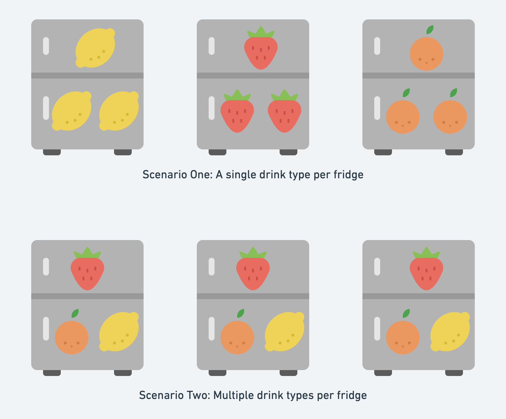
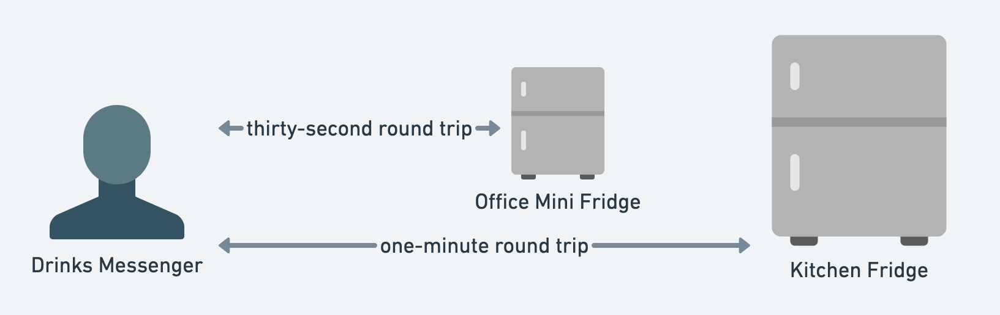

The workplace ‘happy hour’ is a beloved ritual. The opportunity to meet coworkers in a relaxed setting is a great opportunity for informal discussions on recent projects and ideas. It was in these surroundings that I first found myself creating beverage analogies. My theory in approaching this exercise is that the building blocks of modern web applications are intentionally designed to be easily understood at a high level of abstraction by those without technical backgrounds. 
In that spirit, this blog will introduce five technical concepts via happy-hour analogies, before bringing them together in a functional web architecture.
  - [Analogy One: Consistency versus Availability](#consistency-vs-availability)
  - [Analogy Two: Sharding](#sharding)
  - [Analogy Three: Load Balancing and Queueing](#load-balancing-and-queueing)
  - [Analogy Four: Caching](#caching)
  - [Analogy Five: Web Sockets](#web-sockets)
  - [Example Web Application ](#example-webapp)

### An introductory thought exercise

Each week many co-workers meet for a happy-hour gathering. People enjoy various drinks, but since I’m writing this from the Pacific Northwest, I’m going to pick Kombucha as our running example. Currently in our office we have a few people and a couple of fridges. It’s pretty easy for everyone to get a drink when they want it. Imagine things were scaled by tens, hundreds, maybe millions: 
  - What sort of challenges would we face and how should we deal with them?
  - How many unique drinks and flavours can we (or should we) offer?
  - What types of drinks are offered and not offered?
  - If multiple people want drinks at the same time, how many concurrent people can we comfortably accommodate at any one time?
  - If too many people attempt to access a fridge at one time, how should they queue (eg. is it strictly first-in-first-out or do we have a VIP lane)?
  - What’s an acceptable/unacceptable wait time for people to get a drink?
  - How does the demand for drinks compare at 8am on a Monday versus 4pm on a Friday?

<h2 id="consistency-vs-availability">Analogy One: Consistency versus Availability</h2>

My workspace is an office with multiple rooms and a fridge located a short walk away. It’s not uncommon for someone to venture to another room to pick up multiple drinks for other people. 
A scenario we face is that people often aren’t certain about the exact fridge inventory but take drink requests based on presumptions and the fridge’s most-recent known inventory (eg. “There should be an orange Kombucha in the fridge. Please get one for me if it's available”). In this scenario we are sacrificing the guarantee that our drink inventory is correct (or ‘consistent’) in favor of being immediately able to take people’s orders (or be ‘available’) in the moment that people want drinks. Alternatively we could of course check the fridge first to ensure that the inventory is correct, but that would slow things down, sacrificing availability for consistency. 

The tradeoff here is that in order to guarantee that an order can be fulfilled, the drinks messenger must first confirm that the requested drinks are present in the fridge. This analogy does not translate literally to how a typical web application would work, but the commonality is that strong consistency requires additional steps which in turn impact the speed of delivery. Take the example of a web application with its data hosted across multiple database servers. In order to assure strong consistency, we must ensure that for every database read after a change is written, the latest version of this data will be read. The takeaway here is that in the real world it is typically a choice between prioritising either consistency or availability.

<h2 id="sharding">Analogy Two: Sharding</h2>

Have you ever found yourself blindly rummaging through a fridge or a bucket of drinks to find your desired beverage? It can be inefficient and time-consuming. In our running analogy we currently have a fridge containing multiple drinks. Imagine the number of people and drinks tripled and required additional fridges. With this scale comes new possibilities and new challenges for categorising and distributing drinks across fridges.

Take the first scenario of each fridge containing only a single type of drink. 
If someone requires only one type, the task of retrieving drinks from the fridge is relatively efficient. 
This efficiency diminishes though if the person requires various types and must visit multiple fridges. 
Alternatively we could stock each individual fridge with an even split of all three drink types, but if 90% of people wanted orange flavour, the utilization of the fridges would not be optimal in this scenario either. 
In sharding databases, our challenge is to balance and rebalance partitions of data across multiple locations in as even and efficient a manner as possible. 
Similar to our fridge analogy, this is achieved by partitioning our data into smaller groupings, or 'shards'.

Some common techniques for sharding data include:
  - **Regional:** Usually partitioned by a static location identifier in the data, based on where the data is normally generated and consumed (eg. US East, US West, Canada etc.)
  - **Range:** Usually based on a primary or composite identifier in the data, and partitioned based on groupings within this range (eg. A-C, D-F, H-J etc.)
  - **Hashing:** A hashing algorithm is used to randomly distribute data across the available database shards, which can reduce the risk of a disproportionate concentration of traffic (a 'hotspot') being served in one location.

<h2 id="load-balancing-and-queueing">Analogy Three: Load Balancing and Queueing</h2>

Think about the last time you went to an arena sports game or concert. How did you get inside? Chances are you probably entered by one of many entrances based on your ticket. Otherwise, perhaps you were directed to the least-busy entrances. This segregation of people serves to distribute the fans and increases the rate (or ‘throughput’) at which fans can enter and exit the venue. Like in the physical world, load balancers provide a solution for dispersing web traffic across multiple web servers, reducing the risk of congestion in a single spot.

Let’s continue the analogy of a trip to a game/concert. Once you get inside you might make your way to the bar before queuing again. Were there different queue types? Probably a first-in-first-out queue, but maybe there was also a VIP queue for certain ticket holders.

These concepts persist also in the design of many of the  web applications that you use. It may be as obvious as entering a virtual queue before talking to a customer support representative, or perhaps less apparent, like your online food order getting processed. At a high level, you can think of the utility of these queues to be directly comparable to queues in the physical world. 

As sports arenas direct ticket holders through multiple entrances to achieve efficiency in routing foot traffic, web applications direct online traffic to multiple servers via ‘load balancers’. Like a ticket-holder’s entrance being determined by their ticket details, the routing of website traffic can be dictated by metadata like a user's IP address or the 'cookies' on their device. There are other possible strategies for routing traffic through load balancers, but at a high level you can think of load balancers as a tool to ensure efficient utilisation of servers by directing web traffic evenly across them.

<h2 id="caching">Analogy Four: Caching</h2>

You can call it many names, but everyone hates having to wait, everyone hates ‘latency’.  Imagine if one flavour of Kombucha was significantly more popular than another. It would make sense to make that the most easily-accessible in our fridge. How about if it was a long walk to the fridge? Perhaps we’d put a mini fridge closer to our desks and stock it with the most-popular drinks.

When web applications need to read data, ‘caching’ enables faster retrieval of data than normal database servers. The primary benefit of ‘caching’ data is that it is stored in a server’s memory, which means the data can be read quicker than if it had to be read from the server’s disk. You could think of this as comparable to the benefit of pulling your favourite drinks from the front of a fridge’s shelf versus having to reach to the very back to retrieve them.

Our office mini-fridge analogy introduced the concept of the physical location of a fridge correlating to the speed at which we could retrieve a drink. The physical location of a caching server also contributes to the speed in which we can read data. Indeed, whether data is traveling over the air or a fiber-optic cable, the distance the data must travel will correlate to the speed in which we can receive it. Due to this constraint, cloud vendors like Amazon Web Services offer the ability to cache data at locations in physical proximity to a user base. Say for example we were building an application that recommended the best bars within a five-kilometer radius of a user. There would be a clear benefit in caching Seattle venues from a location in the Pacific Northwest, but less value in caching New York venues in that same physical location. 

<h2 id="web-sockets">Analogy Five: Web Sockets</h2>

Let’s suppose you wanted a drink from another room and needed to phone someone to request it. 
You could place a new phone call each time you had a question, or you could stay on the same phone call until the drink is delivered, permitting a two-way conversation with real-time updates. 
Both options have pros and cons. For example, if the consumer valued real-time updates on their order, a two-way conversation would be more optimal than multiple short calls. 
Maintaining a long call is not ideal either if, for example, the messenger only has one phone but needs to accommodate drinks orders from multiple people. 
Like so many choices in systems design, it is a case of weighing up options to choose the best choice for a given scenario.

Similar to our phone analogy, when you are using an internet-connected application it will communicate with servers via comparable web protocols. 
Our first option is a standard Hypertext Transfer Protocol (HTTP) connection. 
This is a unidirectional request for information from our devices (also known as a ‘client’) to a web server. 
Like phone calls, these are typically short requests for information. 
Our second option is a ‘WebSocket’ connection which enables a single connection with multidirectional communication between client and server. 
If you have ever used an app that showed you real-time updates such as someone’s location or that another user is currently typing a message, you have probably benefited from a WebSocket connection.

<h2 id="example-webapp">Example Web Application</h2>

Finally, we can merge all of the previous analogies together into a single architecture. Let’s create a simple app with the following requirements, to coordinate the tasks of requesting and delivering drinks:
  - Users can use the app to both request drinks and to accept other users’ drink requests.
  - We will refer to the users requesting drinks as ‘consumers’ and those delivering drinks as ‘messengers’.
  - From within the app, users can toggle their availability off and on. If they are available to fetch drinks, they will be sent drink requests that they can accept or refuse via the app.
  -  If a request is not successfully paired with a messenger within three minutes, the request will terminate with the drink consumer notified to try again later.
  - The maximum number of drinks requestable is four. This limitation is intentional, so that orders can be easily carried by the drinks messengers.

The above brings together our previous analogies:
  - Users are first routed through a load balancer which relays their traffic to an available web server
  - Information on locally-available drinks can be loaded via the cache
  - Precise drink inventory is tracked via a database which is sharded based on the regions that drinks are located in.
  - A WebSocket connection is favoured to prioritise real-time updates for drink requests.
  - New drinks requests are placed into a queue which is used by two 'matchmaker 'services that attempt to match drink consumers with drink messengers. A request is removed from the queue if it is completed, canceled, or three minutes pass without a messenger accepting the request.

## Conclusion

An appropriate quote to draw us towards conclusion is from the philosopher Alfred Korzybski, who stated that "the map is not the territory". 
This blog's diagrams and analogies all represent visual and logical abstractions of topics that could be dissected in far greater granularity. 
The beauty here is that the building blocks of the internet, while certainly complicated at a more-granular level, can be understood at multiple levels of abstraction.
Whether you are coming from a technical or non-technical background, I hope that you have gained a new perspective from this blog, or at the very least some new ideas for your next workplace happy hour.
