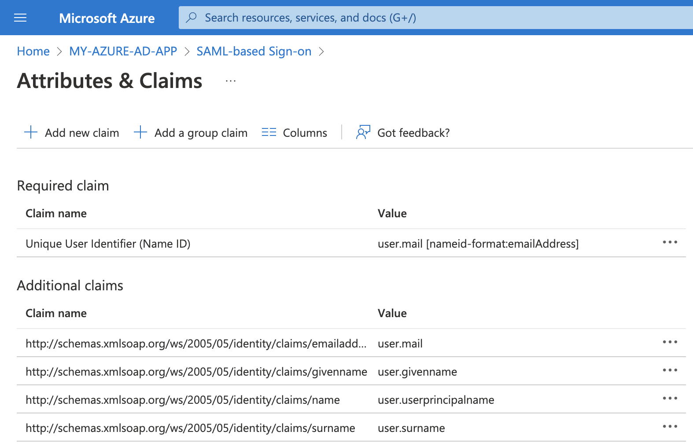
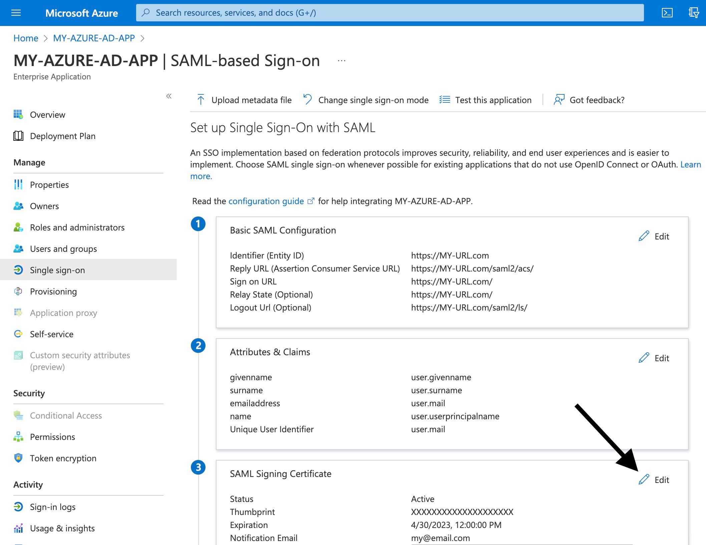
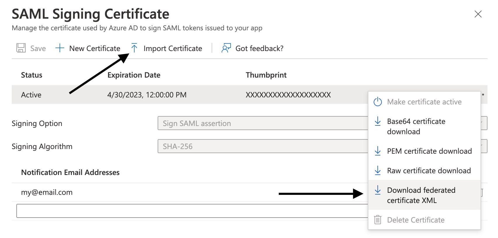
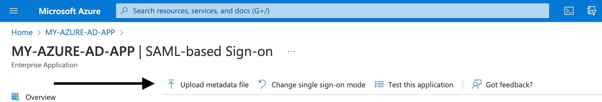

## Introduction
I recently had to undertake the task of deploying a new [Hue](https://github.com/cloudera/hue) container with [SAML authentication](https://docs.gethue.com/administrator/configuration/server/#saml).
In reaching a working solution I found myself troubleshooting more than initially anticipated, in part due to gaps in Hue's documentation and an apparent bug in one of its underlying dependency packages.

My goal in publishing this article is to provide a concise resource for others who are also integrating Hue with Azure Active Directory (AD).
In writing this I'm making the presumption that the majority of readers will have searched the internet for this specific topic and already have a baseline understanding of Hue and AD.
Accordingly, in the interest of brevity, some foundational topics aren't discussed in detail but rather referenced through the inclusion of hyperlinks to external resources.

One final disclaimer is that the solution discussed here is based upon my experience of the latest open-source release, Hue version _4.10.0_. If you are using a future release and/or Cloudera's enterprise version, some syntax/features may differ.

## Choosing a SAML claim
The following diagram [sourced from Azure AD's documentation](https://docs.microsoft.com/en-us/azure/active-directory/fundamentals/auth-saml) outlines the flow through which users of your web app are authenticated against your Active Directory and SAML tokens are returned.


These SAML tokens contain _claims_ (ie. user name, email address etc.) that are used by Hue when each new user logs in for the first time.
Within your Azure AD console, you will see these claims listed for your current app (if you have not already created a new application in Azure AD, [here's a good tutorial from Microsoft's documentation](https://docs.microsoft.com/en-us/azure/active-directory/manage-apps/add-application-portal-setup-sso)).


When searching Google for guidance on SAML configuration in Hue, two of the most prominent and relevant resources are [this blog post](https://www.davehill.ie/code/hue-saml-azure-part-1/) and [this discussion on the Cloudera forum](https://community.cloudera.com/t5/Support-Questions/HUE-fails-with-saml/td-p/82559), both of which direct the user towards an 'attribute mapping' approach.
This approach involves creating a configuration file that enables Hue to map our SAML claims to internal variables that it then uses to populate its database. Unfortunately, there appears to be a bug in the current open-source release of Hue(v4.10.0) which results in this mapping approach failing.

With this context in mind, I found the simplest option to be an alternative solution which is briefly referenced in the previously-linked Cloudera forum discussion. 
As opposed to the other AD claims, _Unique User Identifier (Name ID)_ is ingested by Hue without the need for any custom mapping. This results in the following `hue.ini` configuration:
```
username_source=nameid
name_id_format="urn:oasis:names:tc:SAML:1.1:nameid-format:emailAddress"
```

We will return to the `hue.ini` configuration in more detail later, but for now let's focus on the `name_id_format` value.
Deeper context and specific formatting references can be found [in the Azure AD documentation](https://docs.microsoft.com/en-us/azure/active-directory/develop/single-sign-on-saml-protocol#nameidpolicy), but at a high level, there are four possible formats that we can choose to configure:
* `emailAddress` returns NameID claim in e-mail address format
*  `persistent` returns the NameID claim as a pairwise identifier, a randomly-generated value. This is created once and the same value is returned every subsequent time.
*  `transient` returns the NameID claim as a randomly generated value. A new value is generated each time a user logs in.
*  `unspecified` dictates that your identity provider will determine the claim format that is returned. In Azure AD's case this means that a pairwise identifier is returned.

As the other formatting options return randomly-generated values, `emailAddress` is the obvious choice if we want the ability to easily identify users in the Hue admin console.

## Generating SSL keys

In order for our Service Provider (Hue) and Identity Provider (Azure AD) to communicate securely, we must configure an SSL certificate and private key.
Azure AD automatically creates a certificate for new apps, but as the corresponding private key is not made available to us and Hue requires this, we will need to create a new key/cert and upload to Azure AD. 
Specifically, Azure AD requires a `.pfx` filetype and `rsa` encryption while Hue requires `.PEM` files with a `X.509` certificate. 

With these requirements in mind, we can create the `.pem` key and cert files before converting to `.pfx` and uploading to Azure AD.
```
openssl req -x509 -newkey rsa:4096 -nodes -keyout hue_key.pem -out hue_crt.pem -days 365
openssl pkcs12 -inkey hue_key.pem -in hue_crt.pem -export -out hue.pfx
```

The second of these commands will prompt you for a password. Make note of your chosen password as you will need it when uploading the `.pfx` file to Azure AD.
For a granular reference on _openssl_, see the [openssl documentation](https://www.openssl.org/docs/manmaster/man1/openssl.html) or pass the `--help` option in your command line (eg `openssl req --help`).
With our `hue.pfx` file created we can now upload it to Azure AD and download the Identity Provider metadata file that Azure will auto-generate.

Within the Azure AD console, you should see a similar layout to this:


If you edit the  `SAML Signing Certificate` section, you will see options to import a `.pfx` certificate and download a 'federated' XML file for the certificate that you have just uploaded.


## Configuring Hue 

For setting the configuration, your `hue.ini` file should contain the following keys:
```
[desktop]
  redirect_whitelist=^\/.$,https:\/\/login.microsoftonline.com\/YOUR-UNIQUE-URL-SLUG\/.*$

  [[auth]]
    backend=libsaml.backend.SAML2Backend

[libsaml]
  xmlsec_binary=/usr/bin/xmlsec1
  metadata_file=/opt/cloudera/security/saml/azure-ad-metadata.xml
  key_file=/opt/cloudera/security/saml/my_key.pem
  cert_file=/opt/cloudera/security/saml/my_cert.pem
  entity_id=https://MY-URL.com
  username_source=nameid
  name_id_format="urn:oasis:names:tc:SAML:1.1:nameid-format:emailAddress"
```

[Hue's documentation](https://docs.gethue.com/administrator/configuration/server/#saml) is a useful reference for most configuration settings.
As this documentation is not entirely thorough, referencing [hue.ini in Hue's source code](https://github.com/cloudera/hue/blob/master/desktop/conf.dist/hue.ini) will give deeper insights with additional comments that are not reflected in the documentation.

## Uploading Hue metadata to Azure AD
Our final step is to upload Hue's metadata `.xml` file to Azure AD.
Upon starting Hue, a metadata file will be viewable at `https://MY-URL.com/saml2/metadata/`.
After downloading a copy of this file, you can upload to Azure AD via its `Upload metadata file` button.


Once this metadata file is uploaded, you will now be set to authenticate Active Directory users on Hue via Single Sign On. 


