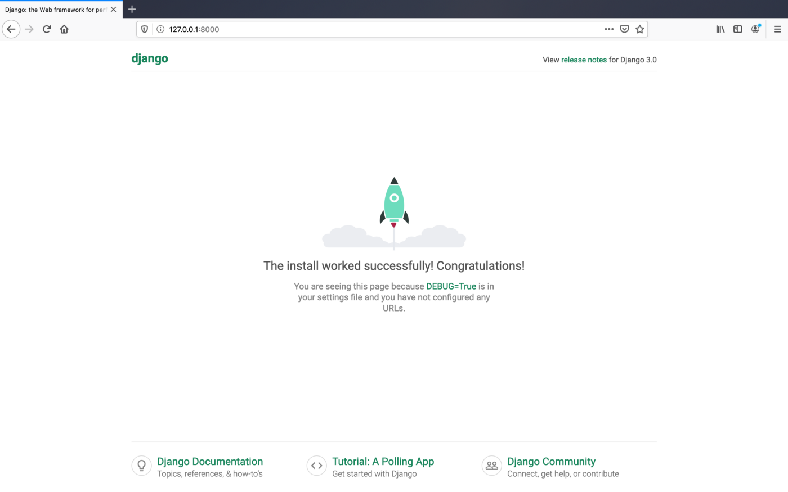
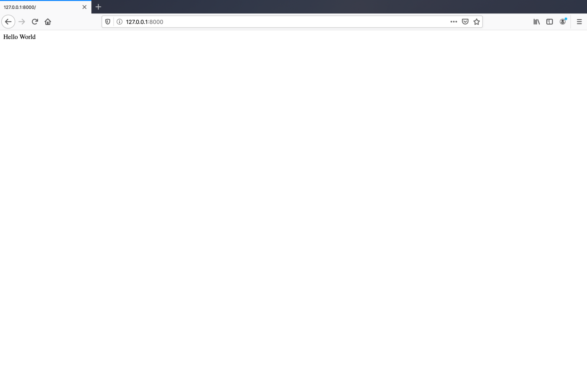

I recently encountered a use-case that required the management of multiple long-running backend tasks while also necessitating granular updates on the state and progress of each task. The feature was to be integrated into an existing Django codebase and our team desired a UI with multiple progress bars. Ultimately, I couldn’t find a tutorial covering quite what I was looking for, so my purpose here is to create the type of code demo and tutorial that I would have wanted for my specific needs, when beginning this journey. One popular tool for Python developers is [Celery](http://www.celeryproject.org/), a ‘task queue’ which facilitates the queuing and concurrent execution of multiple tasks (i.e. any manner of Python function you may need to run). [Celery-Progress](https://github.com/czue/celery-progress), is a great Python package for — you guessed it — easily provisioning progress bars to monitor Celery tasks.

So, what will this app cover? At a high level, the creation of a Django app which concurrently runs eight backend processes and provides state updates via progress bars and related metadata. In terms of showcasing Celery, I opted to go with something visually stimulating and poll the [NASA Astronomy Image of the Day API](https://api.nasa.gov/) forty times. Querying an API once is of course a short task on its own, but the logic outlined in this demo could be applied to any long-running task. If you’d rather jump straight into the finished codebase, you can clone a working example directly from [GitHub](https://github.com/oisinBates/celery_progress_demo). Below is an example of the project we will be building, and you can check out a screen-recording of the app in progress [here](https://www.youtube.com/watch?v=dWAJru1xx34).


For those wishing to jump to a specific topic, the topics are structured in the following order:
* [Web Application Architecture](#web-application-architecture)
* [Initial Django Configuration](#initial-django-configuration)
* [Configuring Celery and Celery-Progress](#configuring-celery)
* [Frontend Logic and Templates](#frontend-logic-and-templates)
* [Running the final app and general parting thoughts](#running-final-app)

<h3 id="web-application-architecture">Web Application Architecture</h3>

This web app is built with the Django framework. It uses a NASA API to retrieve random images and image metadata. The processes of concurrently/repeatedly polling this API is managed by a task queue (Celery) which queues tasks via a message broker (RabbitMQ) and writes the state of each task to a database cache (Redis). The visualization of the tasks is managed by a Python package named celery-progress. This package, though written in Python, uses JavaScript on the frontend to poll our Redis cache for the current state of our Celery tasks.

Here is a high-level overview of the architecture we’ll be implementing:


<h3 id="initial-django-configuration">Initial Django Configuration</h3>

The following commands will create a Python [virtual environment](https://docs.python.org/3/library/venv.html) with all the necessary packages, before creating a new Django project and app, and starting a webserver to host the project.

```bash
# Create a new virtual environment and folder for this demo
mkdir celery_demo 
cd celery_demo 
python3 -m venv myvenv 
source myvenv/bin/activate 

# install the necessary requirements via pip
python3 -m pip install --upgrade pip 
printf "celery==4.4.2\ncelery-progress==0.0.10\nDjango==3.0.6\nnasapy==0.2.6\npandas==1.0.3\npython-decouple==3.3\nrequests==2.23.0" >> requirements.txt 
python3 -m pip install -r requirements.txt 

# Create a new Django project and app 
django-admin startproject demo_project 
cd demo_project/ 
python3 manage.py startapp demo_app 

# Serve the new Django app
python3 manage.py runserver
```

Once you have run the above commands, navigate to http://127.0.0.1:8000/ in your web browser and you should see the following:



<h3 id="configuring-celery">Configuring Celery and Celery-Progress</h3>

Having provisioned a new Django project, we can now begin adding our desired functionality. First off, let’s configure celery and celery progress. Create a new file called celery.py within our Django project (ie. `celery_demo/demo_project/demo_project/celery.py`).

```bash
from __future__ import absolute_import, unicode_literals
from celery import Celery
from decouple import config
import django
import os

os.environ.setdefault('DJANGO_SETTINGS_MODULE', 'demo_project.settings')

app = Celery('demo_project', backend='redis://localhost', broker='pyamqp://')

# Using a string here means the worker doesn't have to serialize
# the configuration object to child processes.
# - namespace='CELERY' means all celery-related configuration keys
#   should have a `CELERY_` prefix.
app.config_from_object('django.conf:settings', namespace='CELERY')

# Load task modules from all registered Django app configs.
app.autodiscover_tasks()

@app.task(bind=True)
def debug_task(self):
    print('Request: {0!r}'.format(self.request))
```

In order to track the state of our tasks, it’s necessary to configure Celery’s [result backend](https://docs.celeryproject.org/en/v4.0.1/userguide/configuration.html#result-backend). If we were setting this value via a config file, we would set a value for `results_backend`, but since we’re setting it directly when initializing our Celery app, we can just set the value via a parameter named `backend`. If you have already had some exposure to Celery, one design choice that may stand out to you is the use of RabbitMQ for Celery’s message broker but not for the results backend.

I’ll approach this topic with both a short answer and a longer answer for those wishing for a lower-level explanation.

**Short Answer:** Due to how the celery-progress package works, asynchronous tasks will fail with RabbitMQ but will work with Redis.

**Long Answer:** Celery has both an [Advanced Message Queuing Protocol](https://en.wikipedia.org/wiki/Advanced_Message_Queuing_Protocol) (AMQP) and a [Remote Procedure Call](https://en.wikipedia.org/wiki/Remote_procedure_call) (RPC) backend. [This blog post](https://patrick.cloke.us/posts/2019/10/04/celery-amqp-backends/) provides a good explanation of the design in terms of the limitations of each backend with regards Celery. [Celery’s AMQP backend is now deprecated](https://docs.celeryproject.org/en/stable/internals/reference/celery.backends.amqp.html) though and its documentation advises the [RPC backend](https://docs.celeryproject.org/en/stable/internals/reference/celery.backends.rpc.html) for those wishing to use RabbitMQ for their results backend. The issue with the RPC backend is that, [in the words of Celery’s documentation](https://docs.celeryproject.org/en/latest/userguide/tasks.html#rpc-result-backend-rabbitmq-qpid), “it doesn’t actually store the states, but rather sends them as messages. This is an important difference as it means that a result can _only be retrieved once_, and _only by the client that initiated the task_”. As a consequence, celery-progress fails to successfully pull all task states once the user adds multiple concurrent tasks.

An alternative for our Celery backend, that will support concurrent tasks, is Redis. This combination is framed as a ‘popular choice’ in celery’s documentation as RabbitMQ is less prone to data loss. In terms of choosing a message broker, Celery’s documentation warns “Redis is also feature-complete, but is more susceptible to data loss in the event of abrupt termination or power failures.” Depending on your use-case, Redis or RabbitMQ alone could be a good fit. We’re going to use both for this scenario. The simplest way to provision Redis and RabbitMQ is via Docker. You can pull a [Redis image](https://hub.docker.com/_/redis/) and a [RabbitMQ image](https://hub.docker.com/_/rabbitmq) from Docker Hub and provision a docker container by running this single command in your terminal:

```bash
docker run -d -p 5672:5672 rabbitmq 
docker run -d -p 6379:6379 redis
```

Now that we’ve created our celery.py file, it’s necessary to update our project’s _init_ file (`demo_project/__init__.py`) so that our celery app is imported when Django starts up. For those seeking a deeper insight, this Celery/Django configuration is based off the Celery tutorial [First Steps With Django](https://docs.celeryproject.org/en/stable/django/first-steps-with-django.html).

```python 
from __future__ import absolute_import, unicode_literals

# This will make sure the app is always imported when
# Django starts so that shared_task will use this app.
from .celery import app as celery_app

__all__ = ('celery_app',)
```

The final piece of the Celery setup is to create the function for our logic. Let’s create a file called tasks.py inside our Django app (ie. `celery_demo/demo_project/demo_app/tasks.py`)

```python 
from celery import shared_task
from celery_progress.backend import ProgressRecorder
import datetime
from nasapy import Nasa
import random
import time

nasa = Nasa(key="Generate your API Key at https://api.nasa.gov/")

@shared_task(bind=True)
def get_nasa_image(self, seconds):
    progress_recorder = ProgressRecorder(self)
    result = 0
    for i in range(seconds):
        time.sleep(4)
        result += i

        start_date = datetime.datetime.strptime('06/16/1995', '%m/%d/%Y')
        end_date = datetime.datetime.now()
        time_between_dates = end_date - start_date
        days_between_dates = time_between_dates.days
        image_not_suitable = True

        while image_not_suitable:
            random_number_of_days = random.randrange(days_between_dates)
            random_date = start_date + datetime.timedelta(days=random_number_of_days)
            nasa_image_result = nasa.picture_of_the_day(random_date)

            if 'url' in nasa_image_result and nasa_image_result['url'].endswith(('.bmp', '.gif', '.heif', '.jpeg', '.jpg', '.png', '.svg', '.webp')):
                break

        progress_recorder.set_progress(i + 1, seconds, description=nasa_image_result)
    return result
```

Our task could potentially have done any manner of work. It seemed more fun though to do something more interesting than, say, counting to 100. Our task will be retrieving random images from NASA’s _Astronomy Picture of the Day API_. See [api.nasa.gov](http://api.nasa.gov/) for further info and to generate your own API key. As the API sometimes links to YouTube videos and interactive web pages, it makes sense from a visual perspective for us to only link image files. The task itself is relatively straightforward. Iterate through a numerical range and for each iteration do the following:

1. Generate a random date within a valid date range
2. Retrieve an image for this date
3. Check if the image is valid and repeat steps 3 + 4 if necessary, until a valid image file is retrieved
4. Update Celery’s progress with an image URL and metadata

One cool feature of note is that metadata is being passed back in JSON format. With Celery configured and our celery task written, we can now build out the Django frontend. The first step is integrating celery-progress; a Python package that manages the polling of celery’s results backend and visualizes it with progress bars. Celery polls Redis every 500 milliseconds, updating the progress bars on if necessary.

First off, let’s update our projects urls file (`demo_project/demo_project/urls.py`) with the following:

```python
from django.contrib import admin
from django.urls import include, path, re_path

urlpatterns = [
    re_path(r'^', include('demo_app.urls')),
    re_path(r'^celery-progress/', include('celery_progress.urls')),
]
```

In our project’s _settings_ file (`celery_demo/demo_project/demo_project/settings.py`), we need to add _demo\_app_, _celery_, and _celery\_progress_ to the INSTALLED_APPS variable in our settings.py file

```python
INSTALLED_APPS = [
    'django.contrib.admin',
    'django.contrib.auth',
    'django.contrib.contenttypes',
    'django.contrib.sessions',
    'django.contrib.messages',
    'django.contrib.staticfiles',
    'demo_app',
    'celery',
    'celery_progress',
]
```

We also need to update our project’s _views_ file (ie. `celery_demo/demo_project/demo_app/views.py`)

Here we are adding a new view which will call our Celery task eight times. Each individual Celery task will then poll NASA's API five times. In order for us to track the progress of each task on the frontend, it is necessary to return the id of each Celery tasks. I have chosen to go with a dictionary data structure as it allows us to iterate easily through multiple concurrent task ids. The logic iterates from 0 to 7, creating a dictionary which maps each number in the range to its corresponding Celery task.

```python 
from django.contrib import admin
from django.urls import include, path, re_path

urlpatterns = [
    re_path(r'^', include('demo_app.urls')),
    re_path(r'^celery-progress/', include('celery_progress.urls')),
]
```

<h3 id="frontend-logic-and-templates">Frontend Logic and Templates</h3>

Within our Django app, create a file named urls.py (ie. `celery_demo/demo_project/demo_app/urls.py`). The purpose of this is to map a template file to the URL path. In our case it’s our webapp’s root directory (ie. What is displayed at http://127.0.0.1:8000/).

```python 
from django.contrib import admin
from django.urls import include, path, re_path

urlpatterns = [
    re_path(r'^', include('demo_app.urls')),
    re_path(r'^celery-progress/', include('celery_progress.urls')),
]
```

The next logical step is to create our template file. Within the Django app’s _templates_ folder, create another folder named _demo\_app_ and a file named _index.html_ within it. (ie. `celery_demo/demo_project/demo_app/templates/demo_app/index.html`). The level of nesting in this file path may seem excessive but the namespacing is an important discipline that would become apparent if this Django project had another app containing a template named index.html. From the [Django documentation](https://docs.djangoproject.com/en/3.0/intro/tutorial03/): _"Django will choose the first template it finds whose name matches, and if you had a template with the same name in a different application, Django would be unable to distinguish between them."_

Our template will be somewhat involved, so now is a good time to check and ensure that everything is working as expected. Let’s write the text ‘Hello World’ to this template file and confirm that everything is working ok by checking our webapp in the browser. Run `python3 manage.py runserver` in your terminal and you should see something like this in your browser at http://127.0.0.1:8000/.



Now let’s fill out our index.html template properly.

```html
<!DOCTYPE html>
<html lang="en">
    <head>
        <title>Celery-Progress Example</title>
        <meta charset="utf-8">
        <meta name="viewport" content="width=device-width, initial-scale=1">
        <link rel="stylesheet" href="https://maxcdn.bootstrapcdn.com/bootstrap/4.4.1/css/bootstrap.min.css">
        <script src="https://ajax.googleapis.com/ajax/libs/jquery/3.4.1/jquery.min.js"></script>
        <script src="https://cdnjs.cloudflare.com/ajax/libs/popper.js/1.16.0/umd/popper.min.js"></script>
        <script src="https://maxcdn.bootstrapcdn.com/bootstrap/4.4.1/js/bootstrap.min.js"></script>
        <style>
            .nasa-image {
                max-width: 100%;
                max-height: 230px;
                padding-bottom: 5px;
            }
        </style>
    </head>
    <body>
        
        <div class="bg-dark text-white text-center">
            <h1>Celery-Progress Demo</h1>
            <p>Utilising NASA's <i>Astonomy Image of the Day</i> API</p> 
        </div>
        
        <div class="container-fluid">
            <div class="row align-items-end">
                
                    <div class="col-sm-3">
                        <div class="text-center">
                            
                        </div>
                        <a id="progress-bar{{ key }}-image-link" href=""></a>
                        <div class='progress-wrapper'>
                            <div id="progress-bar{{ key }}" class='progress-bar' style="background-color: #68a9ef; width: 0%;">&nbsp;</div>
                        </div>
                        <div id="progress-bar{{ key }}-message">Waiting for progress to start...</div>
                    </div>
                
            </div>
        </div>
    </body>
</html>
<!-- celery logic -->
<script src=""></script>
<script>
    function customProgress(progressBarElement, progressBarMessageElement, progress) {
        barIdentifier = progressBarElement.id.substring(12)
        
        if(progress.current == 0 && progress.total == 100){
            progressMessage = ""
        } else {
            if(progress.description && progress.description.url){
                var nasaImageElement = document.getElementById(progressBarElement.id + "-image");
                nasaImageElement.src = progress.description.url
                var nasaImageLinkElement = document.getElementById(progressBarElement.id + "-image-link");
                nasaImageLinkElement.href = progress.description.url
                nasaImageLinkElement.innerHTML = progress.description.date + " | " + progress.description.title
            }

            taskNumber = parseInt(progress.current)+1
            taskPercentage = taskNumber / progress.total * 100

            progressBarElement.style.backgroundColor = "#68a9ef"
            progressBarElement.style.width = taskPercentage + "%"
            progressBarMessageElement.className = "alert alert-info"
            progressMessage = "Currently fetching image " + taskNumber + " of " + progress.total
        }

        progressBarMessageElement.innerHTML = (
            progressMessage
        );
    }
</script>

<script src=""></script>


    <script>
        document.addEventListener("DOMContentLoaded", function () {
            var progressUrl = "";
            CeleryProgressBar.initProgressBar(progressUrl, {
                onProgress: customProgress,
                progressBarId: "progress-bar{{ key }}",
                progressBarMessageId: "progress-bar{{ key }}-message"
            });
        });
    </script>

```

There are a three main parts to this template: CSS for styling everything , Python logic written in Django’s [template language](https://docs.djangoproject.com/en/3.0/ref/templates/language/), and JavaScript logic for integrating celery-progress and dynamically updating relevant HTML elements.
* In the head of the file the dependencies for the Bootstrap CSS framework are imported. A custom CSS class selector is necessary in addition to Bootstrap’s default stylesheets. The purpose of this class selector is to ensure that all eight images are uniform in height and width, regardless of the dimensions of the source images.
* The code for generating the visual content that the user will see is all nested within one [Bootstrap container](https://www.w3schools.com/bootstrap4/bootstrap_containers.asp). Our view file has already passed a Python dictionary named _celery\_task\_ids_ to this template. The code iterates through this dictionary and dynamically generates the raw HTML that displays the images.
* Most of the JavaScript that the celery-progress package requires is already configured by default. We require two additions. The first is to add event listeners so that celery-progress begins polling Redis for task-state updates as soon as the DOM loads. It is also necessary to override the default onProgress function which celery-progress calls each time a task’s state updates. It is necessary to override this as the HTML used to display our images differs from the celery-progress default; we are updating each element with an image and each image’s metadata.

<h3 id="running-final-app">Running Final App</h3>

With our template complete, we are now ready to view the finished product. First let’s start up Celery:

```bash 
python3 -m celery -A demo_project worker -l info --concurrency=8
```

Where this command is run from is important. It should be run from within this project root folder (ie. `celery_demo/`). Note that a _concurrency_ flag is included and set to eight. Celery defaults this value to the host machine’s number of cores, so if I was to run this on a four-core machine without the concurrency flag set, it would only run four concurrent tasks at a time.

Finally, if it isn’t already running, start the Django webserver:

```bash
python3 manage.py runserver
```

Navigate to http://127.0.0.1:8000/ in your web browser and enjoy 40 unique images from Nasa’s Astronomy Picture of the Day. For reference, [here’s a screen-recording of the web app in action](https://www.youtube.com/watch?v=dWAJru1xx34), and if your web app failed to work as expected, you can of course clone the original from [GitHub](https://github.com/oisinBates/celery_progress_demo).
