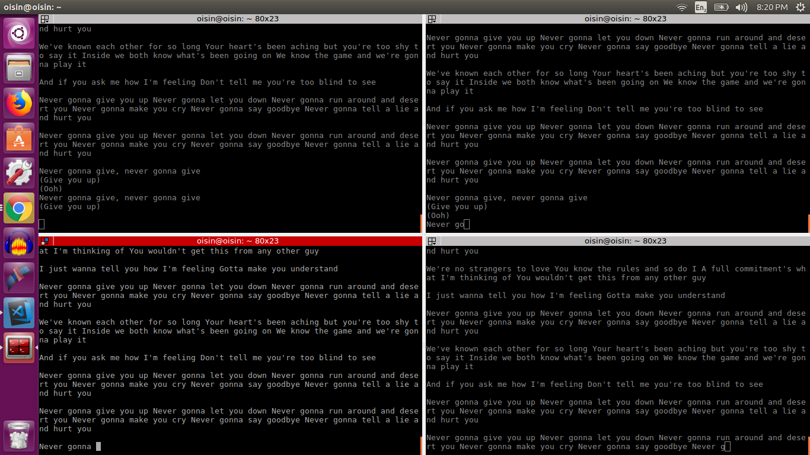

I’ve always found it interesting how some people can be fascinated by the sight of terminals printing logs. The logs could be nonsense, but the sight itself is often enough to attract attention. In this sense, it’s the perfect opportunity for rick-rolling.

```js 
const NEVER_GONNA_GIVE_YOU_UP = {  
  "songForm":[  
    "verse1",
    "preChorus1",
    "chorus",
    "verse2",
    "preChorus2",
    "chorus",
    "chorus",
    "bridge",
    "verse2",
    "preChorus1",
    "chorus",
    "chorus"
  ],
  "chorus":"Never gonna give you up Never gonna let you down Never gonna run around and desert you Never gonna make you cry Never gonna say goodbye Never gonna tell a lie and hurt you\n\n",
  "preChorus1":"I just wanna tell you how I'm feeling Gotta make you understand\n\n",
  "preChorus2":"And if you ask me how I'm feeling Don't tell me you're too blind to see\n\n",
  "verse1":"We're no strangers to love You know the rules and so do I A full commitment's what I'm thinking of You wouldn't get this from any other guy\n\n",
  "verse2":"We've known each other for so long Your heart's been aching but you're too shy to say it Inside we both know what's been going on We know the game and we're gonna play it\n\n",
  "bridge":"Never gonna give, never gonna give\n(Give you up)\n(Ooh) \nNever gonna give, never gonna give\n(Give you up)\n\n"
}

const SLEEP = (lyrics, count) => {
  process.stdout.write(lyrics.charAt(count));
  return new Promise(resolve => setTimeout(resolve, 100));
}

const RICK_ROLL = async () => {
  //boolean as a constant because Rick Astley will never give you up
  const RICK_ASTLEY_IS_GIVING_YOU_UP = false;
  
  //infinite loop for infinite rick-rolling
  while(!RICK_ASTLEY_IS_GIVING_YOU_UP) {
    for(let section of NEVER_GONNA_GIVE_YOU_UP['songForm']) {
      for(let i=0; i<NEVER_GONNA_GIVE_YOU_UP[section].length;i++){
        await SLEEP(NEVER_GONNA_GIVE_YOU_UP[section], i);
      }
    }
  }
}

RICK_ROLL();
```



[GitHub repo here](https://github.com/oisinBates/rickroll.js)