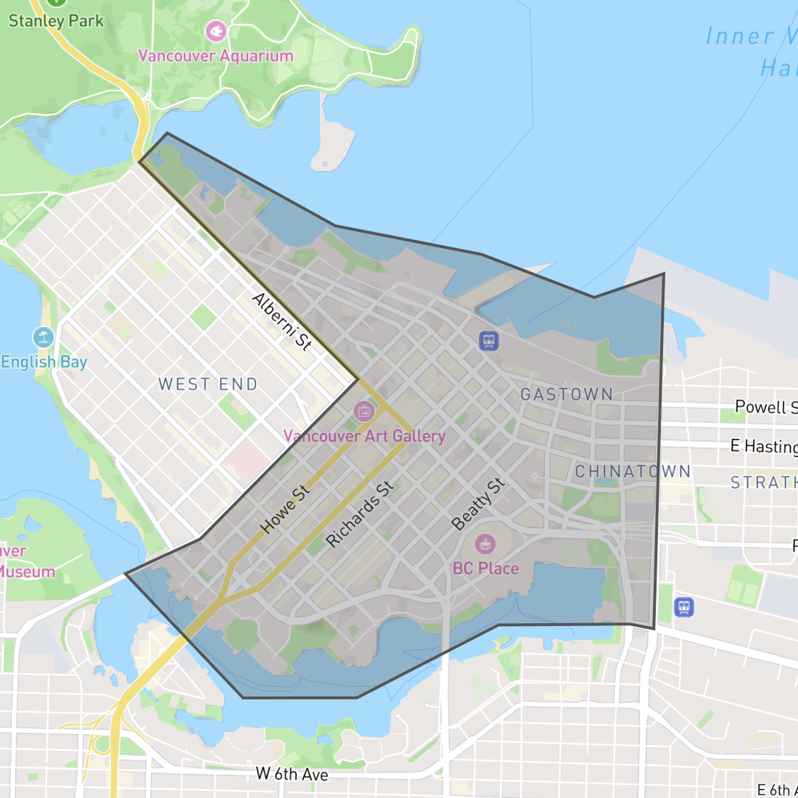
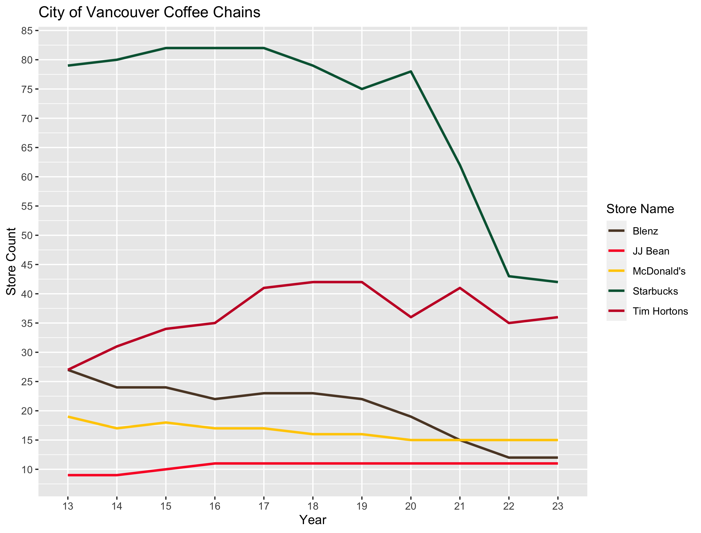
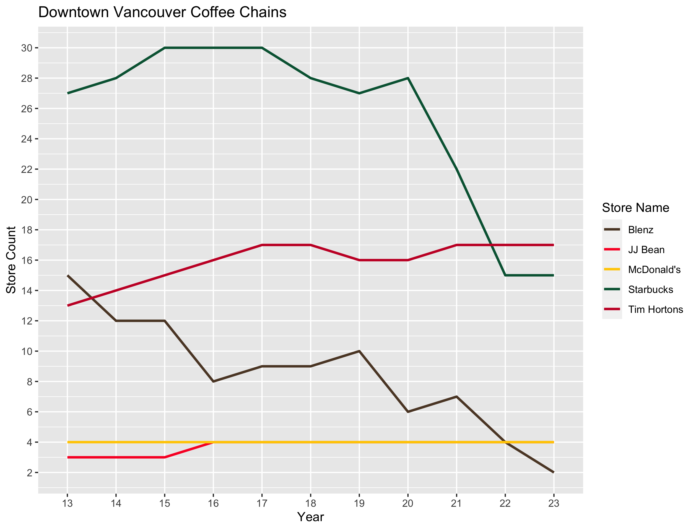
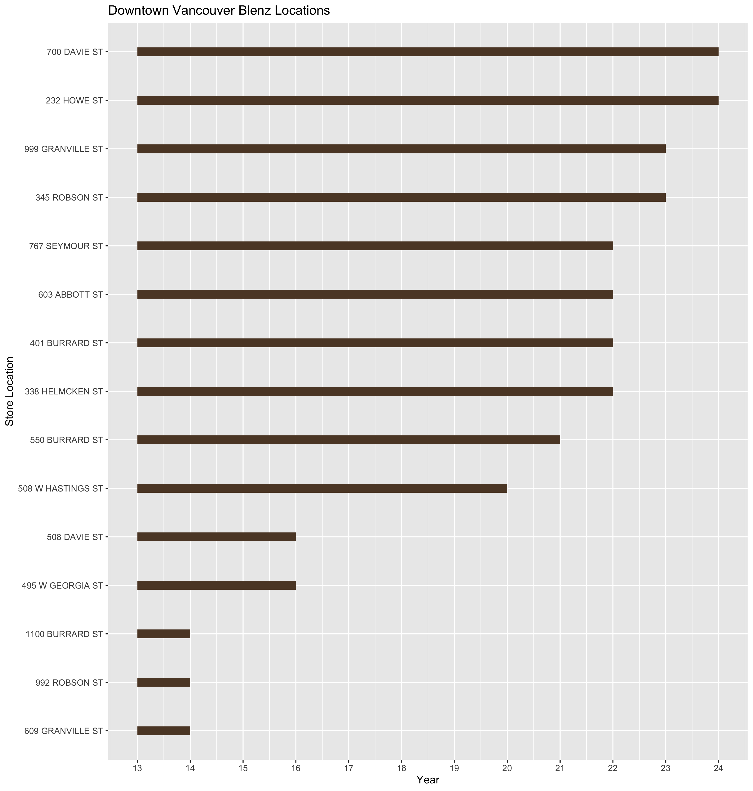
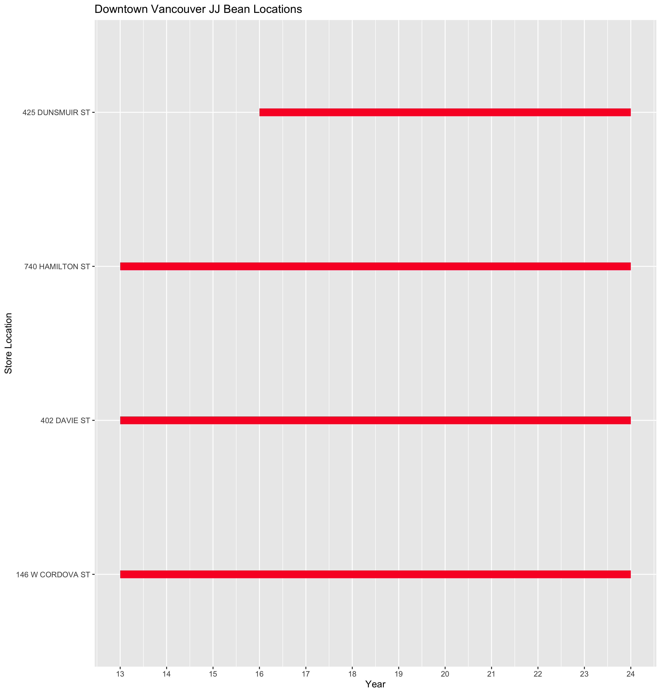
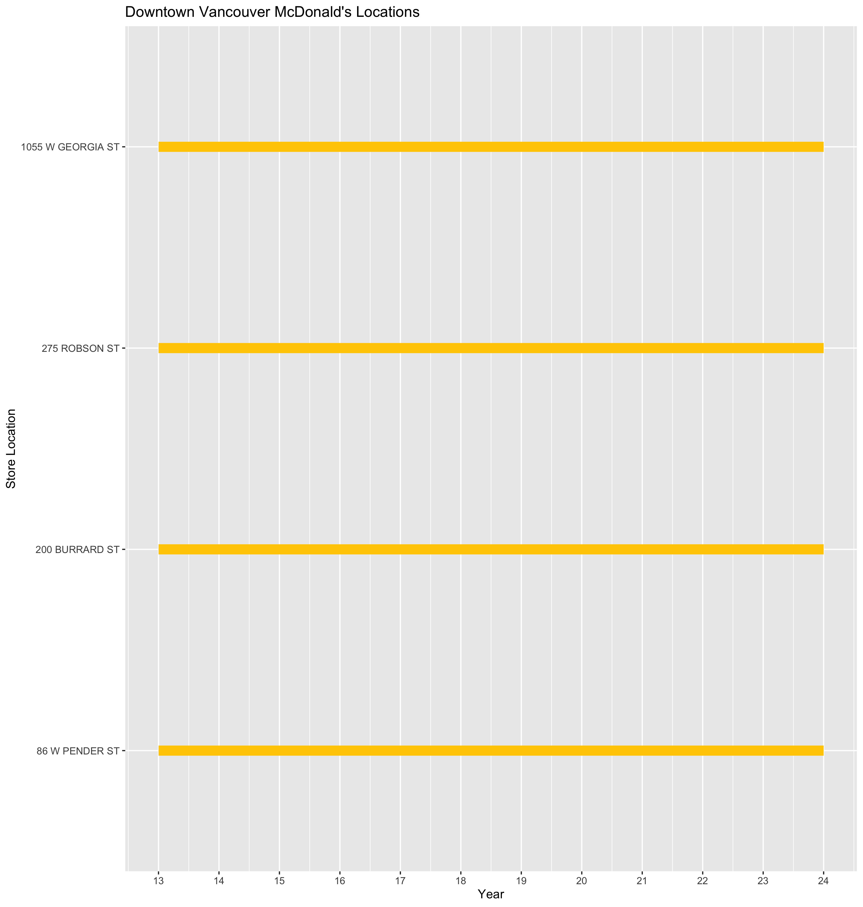
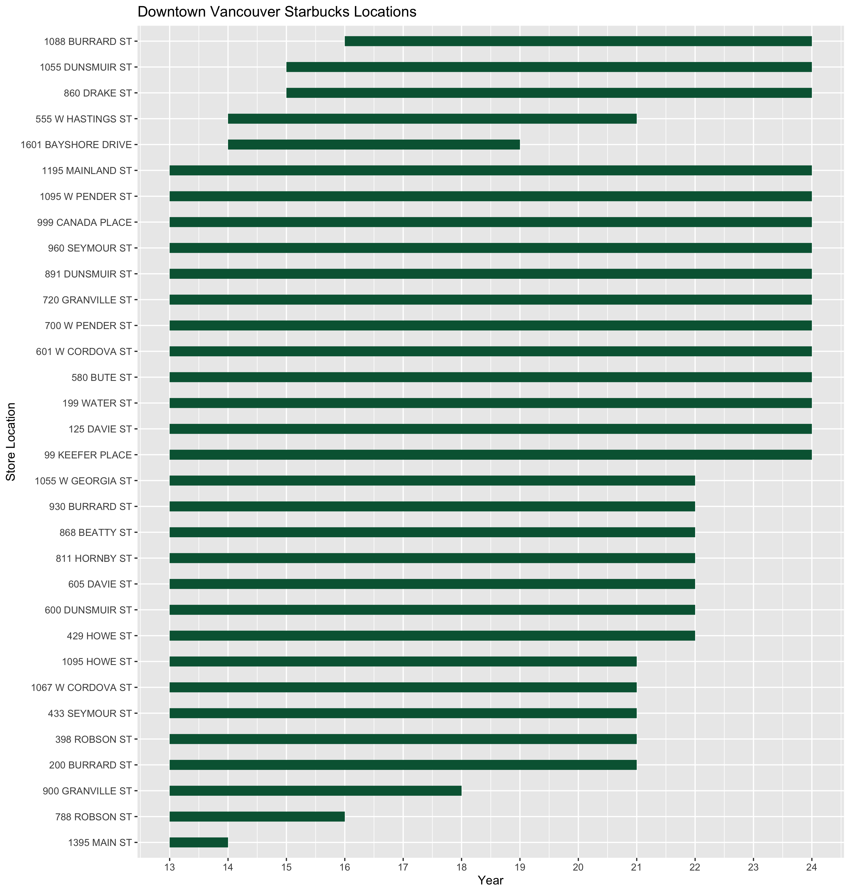
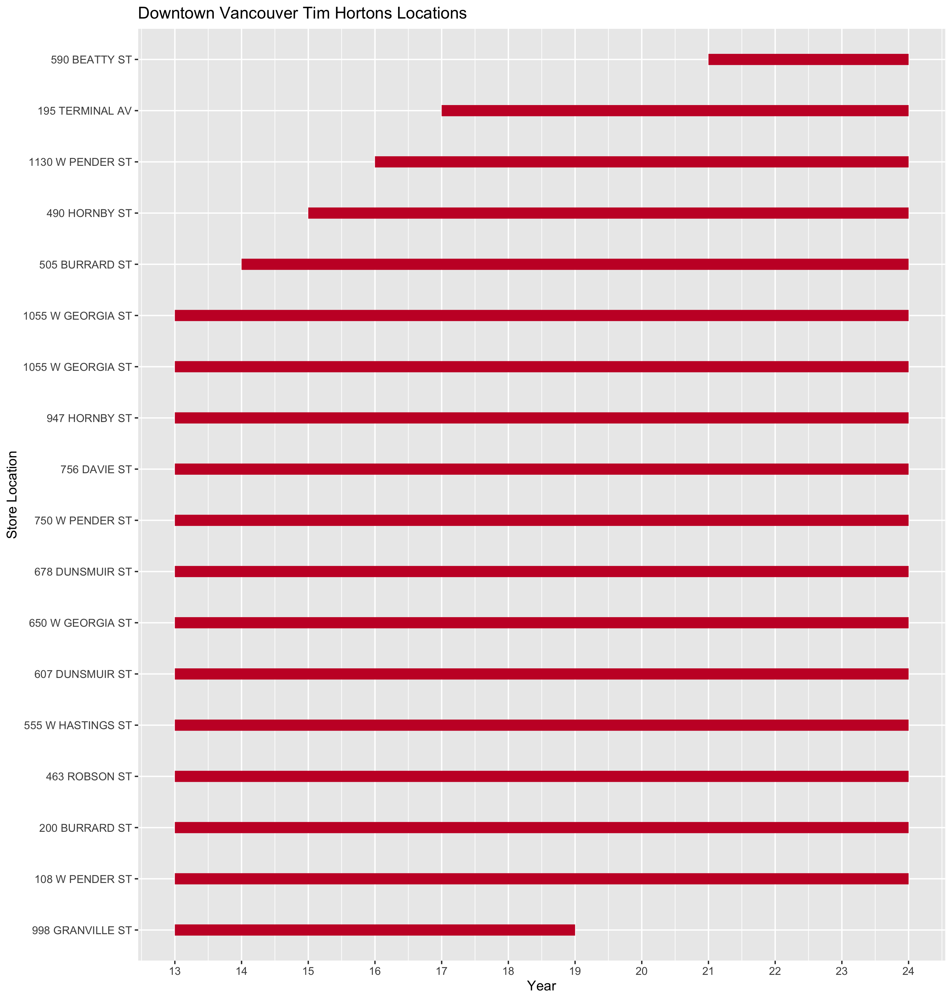
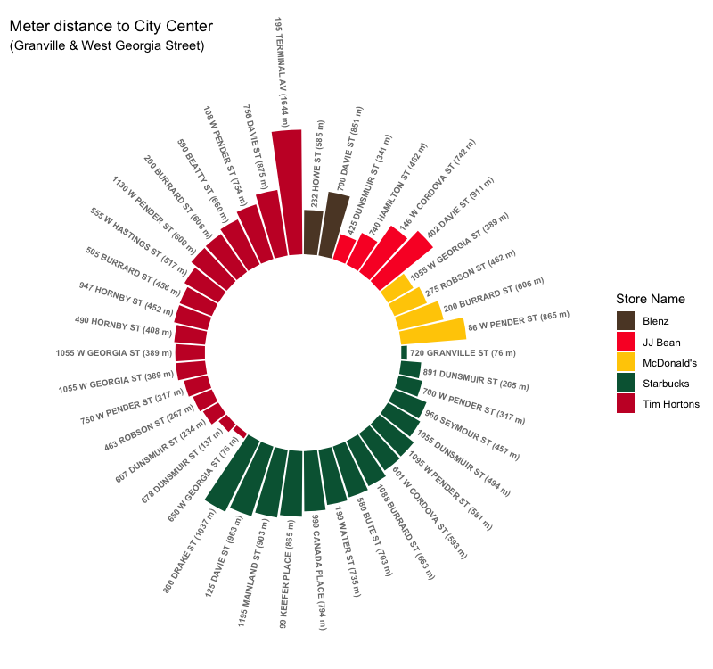

## Introduction
If you were to have visited Downtown Vancouver about five years ago, one thing you'd likely have observed was the sheer density of Starbucks stores.
Indeed, so synonymous was Starbucks with Vancouver at the time that the [reddit.com/r/vancouver](https://www.reddit.com/r/vancouver/) community carried the slogan _"There's a Starbucks on every corner"_. 
Fittingly, this slogan was still in place at the time of Vancouver's first Covid lockdown, before eventually getting removed at a later date (for the very curious, this era [can still be viewed as a snapshot on web.archive.org](https://web.archive.org/web/20200323112242/https://www.reddit.com/r/vancouver/)).

While the Covid-19 pandemic triggered a reduction in the number of physical locations for many businesses, this was especially noticeable for Vancouver's Starbucks stores. 
Upon discovering the [City of Vancouver Open Data API](https://opendata.vancouver.ca/), my curiosity was piqued to dig deeper into this topic. 
The [VancouvR](https://github.com/mountainMath/VancouvR) package (an R interface for this API) was a valuable tool for quickly and easily pulling this data into my local workspace. 

What follows is an overview of how the distribution and density of Vancouver's coffee chains has changed between 2013 and 2023. 
In the interest of brevity, I will provide mostly high-level summaries and visualizations. For those interested, all of the data wrangling and visualization is scripted in the 'R' language while [the source code and aggregated data is viewable on GitHub](https://github.com/oisinBates/vancouver_coffee_businesses).

So what are my goals here? 
My original curiosity was simply to figure out the number of Starbucks locations in Downtown Vancouver. 
From here, it was mostly an exercise in answering other questions that took my interest, and playing with various visualization libraries and methods which I was curious to try.
These questions are answered across the following topics:
  - [How has the number of store locations changed since 2013?](#store-counts)
  - [Visualizing the tenure of each Downtown location](#downtown-store-tenure)
  - [Visualizing the distance of Downtown stores to the City Center](#downtown-store-haversine-distance)
  - [Visualizing the changing distribution of stores from 2017-2023](#changing-store-distribution)
  - [Comparing store ownership and employee numbers](#ownership-and-employee-counts)

## Understanding the source data and relevant assumptions 
This is of course not an exhaustive study; its focus is limited to the 'City of Vancouver'.
For simplicity's sake, from this point forward 'Vancouver' will be used as synonymous with the 'City of Vancouver' boundaries.
Within the city boundaries, there are many unique neighbourhoods. The City of Vancouver uses these neighbourhoods to categorize business licenses, so this is a convenient identifier that is already present within the source data.
Since these neighbourhoods are defined for licensing/zoning purposes, each neighbourhood's boundaries can be referenced on the City of Vancouver website (both [exact geographical coordinates](https://opendata.vancouver.ca/explore/dataset/local-area-boundary/) and [a higher-level verbal explanation](https://vancouver.ca/news-calendar/areas-of-the-city.aspx)).
This is of note as 'Downtown' Vancouver can be open to interpretation, but for the purpose of this case study, 'Downtown' should be interpreted as specifically within the boundaries defined by the City of Vancouver.

For ease of reference, here are the specific boundaries defined by the City of Vancouver:

Another potential source of ambiguity is the individual business types that are counted in this study. 
For example, Starbucks has premises registered under the license categories of _'Wholesale  Dealer'_ and _'Instruction'_ at _2930 VIRTUAL WAY_ but these aren't businesses intended for the general public.
Accordingly, only businesses with the license types _'Ltd Service Food Establishment'_ and _'Restaurant Class 1'_ are considered (this is essentially all public-facing stores).

The criteria for what should be considered a 'chain' store is somewhat open to interpretation.
Indeed, _Pallet Coffee_ and _Waves Coffee_ respectively have five and four locations currently open in the City of Vancouver.
Ultimately, all of the businesses chosen in this study have over 10 locations, which sets them clearly apart from their smaller competitors.

<h2 id="store-counts">How has the number of store locations changed since 2013?</h2>

With the exception of Tim Hortons and JJ Bean, all other chains have fewer locations in 2023 versus 2013.
Starbucks' presence has declined from 82 stores in 2015-2017 (30 of these Downtown), to 78 stores in 2020 (28 Downtown), and now 42 stores in 2023 (15 Downtown).
The correlation to the Covid pandemic isn't too surprising as [in June 2020 Starbucks announced its intention to close as many as 200 Canadian stores over the coming two years](https://www.cbc.ca/news/business/starbucks-earnings-canada-1.5605902).

The other notable decline is observable in the number of Blenz locations. Though this has been trending downwards for the past decade, it's also of note that Blenz follows a franchise model while the vast majority of Starbucks stores in Vancouver are corporate run.

<h2 id="downtown-store-tenure">Visualizing the tenure of each Downtown location</h2>

The following charts provide an interesting perspective into the lifespans of each Downtown location.
I opted to focus specifically on Downtown locations. This was firstly motivated by the number of store locations and the need to limit the volume displayed in each chart.
Secondly though, as my main interest lies in the shifting presence of coffee chains in Downtown Vancouver, it is logical to focus on this.

<h2 id="downtown-store-haversine-distance">Visualizing the distance of Downtown stores to the City Center</h2>

While brainstorming ideas for interesting visualizations, the concept of a circular bar plot caught my imagination as a means of visualizing the relative density of the City Center stores.
The [Haversine Distance](https://en.wikipedia.org/wiki/Haversine_formula) is used, which is calculated via the [geosphere](https://cran.r-project.org/web/packages/geosphere/geosphere.pdf) R package.
I feel that the interactive maps below offer a simpler and more-elegant solution, but this style of plot was an interesting one to create. 
All of the static plots in this project are generated with the [ggplot2](https://ggplot2.tidyverse.org/) R package.

<h2 id="changing-store-distribution">Visualizing the changing distribution of stores from 2017-2023</h2>

The following maps are generated with [Leaflet](https://rstudio.github.io/leaflet/), an R package that serves as a downstream wrapper for the JavaScript package of the same name.
I chose the years 2017, 2020, 2023 as these represent the most noticeable decline in store locations. 

2017 Coffee Chain Locations:

    <iframe src="/vancouver_coffee_blog/interactive_maps/coffee_chain_locations_2017.html" title="2019 Coffee Chain Locations" style={{width:'800px',height:'600px'}}></iframe>

  

2020 Coffee Chain Locations:

    <iframe src="/vancouver_coffee_blog/interactive_maps/coffee_chain_locations_2020.html" title="2019 Coffee Chain Locations" style={{width:'800px',height:'600px'}}></iframe>

  

2023 Coffee Chain Locations:

    <iframe src="/vancouver_coffee_blog/interactive_maps/coffee_chain_locations_2023.html" title="2023 Coffee Chain Locations" style={{width:'800px',height:'600px'}}></iframe>

  

<h2 id="ownership-and-employee-counts">Comparing store ownership and employee numbers</h2>

In comparing these different chain stores, one interesting observation is that some brands have many franchisees while others are predominantly (or fully) run by the brand's corporate entity. 
Since the City of Vancouver's data originates from human input, it contains many human errors and discrepancies. 
Given the volume of data, I opted not to script/automate further cleaning of the data though [I have outputted the raw data aggregations to GitHub](https://github.com/oisinBates/vancouver_coffee_businesses/tree/main/output/raw_data). 

Data cleanliness aside, a few interesting observations can be found:
  - All Starbucks stores in the City of Vancouver are corporate run except for the _Wall Centre_ Starbucks.
  - All JJ Bean Stores are run by JJ Bean. 
  - Each Blenz location is run by a unique company. 
  - All Tim Hortons stores are operated by franchisees, though some companies run multiple locations. 
  - Four McDonald's locations are corporate run. 'Bates Restaurants Ltd' is the largest McDonald's franchisee with 6 stores.

It is interesting also to note the differing employment patterns between each chain.
The City of Vancouver's data shows the following for 2023:

| Name        | Locations      | Registered Employees | Average Employees per Location |
| ----------- | -------------- | -------------------- | ------------------------------ |
| Blenz       | 12             | 69                   | 5.75                           |
| JJ Bean     | 11             | 161                  | 14.64                          |
| McDonald's  | 15             | 1018                 | 67.87                          |
| Starbucks   | 42             | 185                  | 4.4                            |
| Tim Hortons | 36             | 706                  | 19.61                          |

[The full data aggregation for 2013-2023 is viewable on GitHub](https://github.com/oisinBates/vancouver_coffee_businesses/blob/main/output/raw_data/premises_and_employee_count.csv).

One obvious differentiation not present is full-time versus part-time employees. 
Also, it is of note that some stores focus primarily on coffee while McDonald's for example, though famous for its coffee, serves a much wider menu.

## Afterthoughts

My goal here was originally just to get some hard numbers to understand the declining presence of Starbucks in Vancouver. 
From here, the comparison of the city's coffee chains was a logical progression, in part due to the volume of data available and the level of data cleaning that would be necessary to properly analyze all of Vancouver's smaller coffee stores.

Having said that, it would not be fitting to conclude without acknowledging some of the incredible [Specialty Coffee](https://sca.coffee/research/what-is-specialty-coffee) available in Vancouver. 
My personal favourite is [Pallet Coffee](https://palletcoffeeroasters.com/), while [the popular 'Vancouver Coffee Snob' blog publishes a yearly Top-10 list which always includes some great roasters](https://www.vancouvercoffeesnob.com/lists/the-10-best-coffee-roasters-in-vancouver-2023/).
